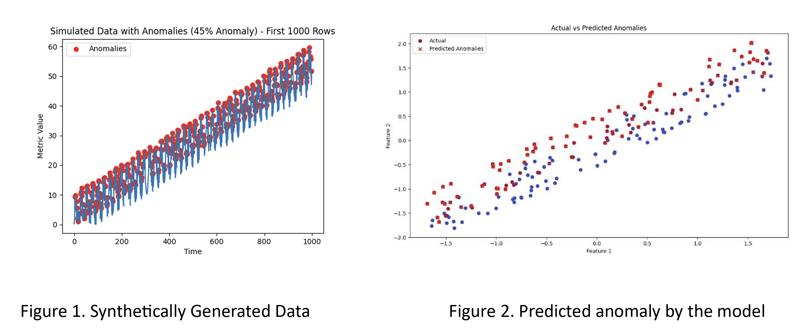

# Anomaly Detection System Implementation

## 1. Algorithm Selection:

In the provided code, three classifiers - Random Forest, Support Vector Machine (SVM), and Logistic Regression - are trained and evaluated on a dataset with features 'Time' and 'Metric' to predict the 'Anomaly' label. The data is split into training and testing sets, features are standardized, and then the classifiers are trained. The performance metrics, including accuracy, precision, recall, F1 score, and confusion matrix, are calculated for each classifier.

The results indicate that the Random Forest classifier outperformed the SVM and Logistic Regression classifiers in terms of accuracy (79.5%), precision (85.9%), recall (69.1%), and F1 score (76.6%). The confusion matrix for the Random Forest classifier shows 92 true negatives, 11 false positives, 30 false negatives, and 67 true positives. These metrics collectively suggest that the Random Forest classifier has a better balance between precision and recall, making it a suitable choice for this classification task. The Random Forest algorithm is chosen as the main algorithm based on its superior performance in accurately predicting anomalies in the given dataset.

## 2. Data Stream Simulation:

The provided Python code generates a synthetic dataset simulating time-series data with anomalies. The dataset consists of 1000 data points and includes normal behavior with a linear trend, sinusoidal seasonality, and added noise. Anomalies are introduced by significantly increasing the values at randomly selected indices. The resulting dataset is stored in a pandas DataFrame, and anomalies are marked in the 'Anomaly' column. The data is exported to a CSV file named 'anomaly_data.csv'. The second part of the code utilizes data visualization to plot the first 1000 rows of the simulated data. The plot displays the time series with anomalies highlighted in red, providing a visual representation of the introduced anomalies. This synthetic dataset and visualization serve as a demonstration for anomaly detection and could be used for testing and evaluating anomaly detection algorithms.

## 3. Anomaly Detection:

Random Forest is an ensemble learning method that can be used for anomaly detection. In the context of anomaly detection, Random Forest works by constructing a multitude of decision trees during training and outputting the class that is the mode of the classes (classification) or mean prediction (regression) of the individual trees.

## 4. Optimization:

Optimization is performed for the Random Forest classifier using GridSearchCV, a technique for hyperparameter tuning. Hyperparameters are configuration settings for machine learning models that are not learned from data but need to be set prior to training. The goal of optimization is to find the combination of hyperparameters that maximizes the performance of the model.

The dataset is first loaded, and the features ('Time' and 'Metric') and target variable ('Anomaly') are defined. The data is then split into training and testing sets, and the features are standardized using the StandardScaler. The Random Forest classifier is initialized, and a grid of hyperparameters is defined, including the number of estimators, maximum depth, minimum samples split, and minimum samples leaf.

GridSearchCV is employed to perform an exhaustive search over the specified hyperparameter values. It uses cross-validation to evaluate the model's performance with different hyperparameter combinations. The best combination of hyperparameters is determined based on the specified scoring metric (in this case, accuracy).

After the grid search, the model is retrained using the best hyperparameters. The performance of the optimized Random Forest classifier is then evaluated on the test set, and metrics such as accuracy, precision, recall, F1 score, and the confusion matrix are calculated.

## 5. Visualization:

